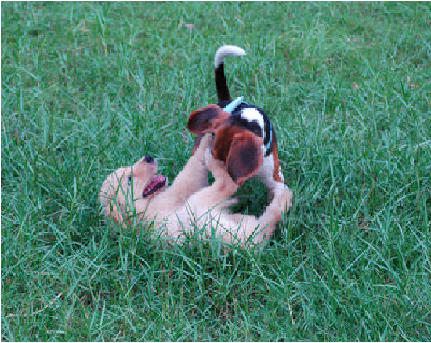
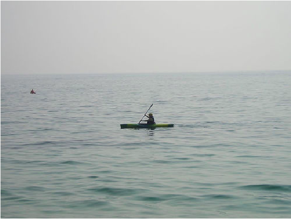
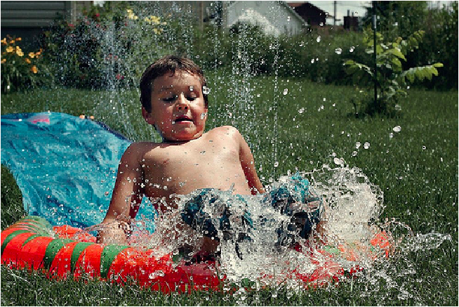
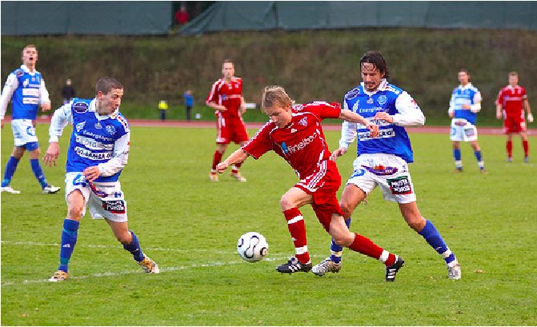
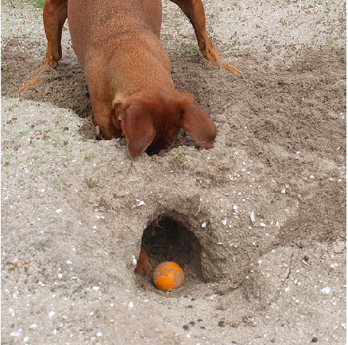
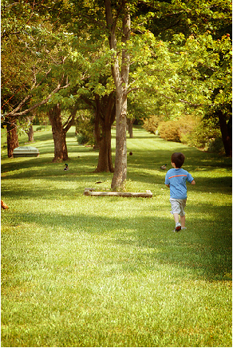
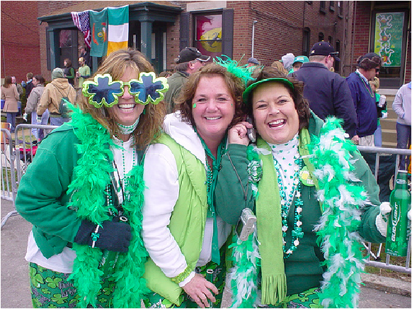

## Neural image captioning with PyTorch

----
Implement neural image captioning models with PyTorch based on encoder-decoder architecture.

The dataset is Flikr8k, which is small for the task. Within the dataset, there are 8091 images, with 5 captions for each image. Thus it is prone to overfit if the model is too complex.

The model architecture is as below. The encoder network for the image is Resnet-101 (could be loaded from torchvision). The decoder is basically a LSTM-based language model, with the context vector (encoded image feature) as the initial hidden/cell state of the LSTM [1]. Attentive model is also implemented [2].

The model is trained by SGD with momentum. The learning rate starts from 0.01 and is divided by 10 in the error plateaus. The momentum of 0.9 and the weight decay of 0.001 are used.

The model [1] can obtain relatively reasonable descriptions (which can be seen in the notebook), with the testset BLEU-1 score 35.7.

### Examples
|                  Images                |                  Captions                  |
| -------------------------------------- | ------------------------------------------ |
|  |         Two dogs play in the grass.        |
|  |       A person is kayaking in the boat.    |
|  |        A boy is splashing in a pool.       |
|  |    Two people sit on a dock by the water.  |
|  | A soccer player in a red uniform is running with a soccer ball in front of a crowd. |
|  |     A snowboarder is jumping off a hill.   |
|  | A brown dog is playing with a ball in the sand. |
|  | A boy in a blue shirt is running through a grassy field. |
|  | A group of people dressed in colorful costumes. |

### Dependencies
Pytorch 0.4.1

### Reference
[1] Show and Tell: A Neural Image Caption Generator (https://arxiv.org/abs/1411.4555)  
[2] Show, Attend and Tell: Neural Image Caption Generation with Visual Attention (https://arxiv.org/abs/1502.03044)
